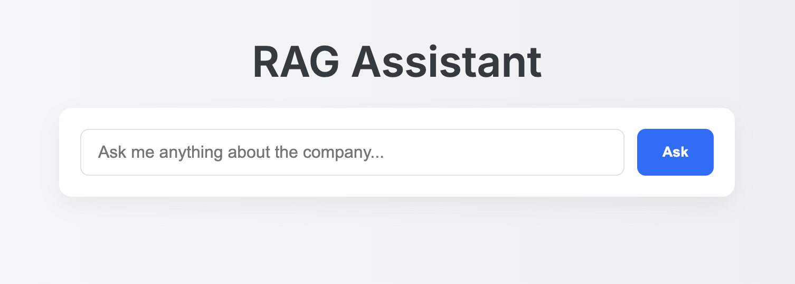

# ai_knowledge_assistant

<a target="_blank" href="https://cookiecutter-data-science.drivendata.org/">
    
</a>

### 🚀 Live Preview
**URL:** https://ai-assistant-rag.up.railway.app/



AI Knowledge Assistant is an intelligent system based on the RAG (Retriever-Augmented Generation) architecture that allows users to ask natural language questions and receive accurate, context-aware answers sourced from their own documents and knowledge base. The project is designed as a learning and research initiative to master the full development cycle of modern AI-powered applications and key tools in the LLMOps ecosystem.

Key Features:
	•	Document ingestion and chunking
	•	Embedding generation and vector storage (e.g., Qdrant, pgvector)
	•	Semantic search and retrieval
	•	Contextual answer generation using LLMs (OpenAI, HuggingFace, etc.)
	•	Prompt engineering and customization
	•	Logging, monitoring, and prompt/version tracking
	•	Full Dockerization and deployment setup
	•	CI/CD integration and scalable architecture

⸻

🛠️ Tech Stack
	 • Python 3.12
	 • Flask
	 • Gunicorn
	 • Docker
	 • OpenAI GPT-4o
	 • Retrieval-Augmented Generation (RAG)
	 • Qdrant
	 • PostgreSQL
	 • SQLAlchemy
	 • Pydantic
	 • Railway
	 • GitHub


## Project Organization

```
.
├── app                      <- Main application package containing all modules and logic
│   ├── api                 <- API routes (e.g., FastAPI endpoints)
│   ├── cli                 <- Command-line interface scripts and commands
│   ├── config              <- Configuration files and environment settings
│   ├── core                <- Core logic of the app (pipelines, orchestration, etc.)
│   ├── dashboard           <- Interactive dashboards or visualization panels
│   ├── database            <- Database models, sessions, and connections
│   ├── embedding           <- Text embedding generation logic
│   ├── evaluation          <- Evaluation scripts (e.g., for RAG or model quality)
│   ├── frontend            <- Frontend code (if any, e.g., templates or static assets)
│   ├── llm                 <- Large Language Model handling (OpenAI, Mistral, etc.)
│   ├── loaders             <- Data/document loading and ingestion utilities
│   ├── logging             <- Logging configuration and custom loggers
│   ├── models              <- Structure of data
│   ├── processing          <- Data preprocessing, cleaning, or transformation logic
│   ├── retriever           <- Vector search and document retrieval logic
│   └── vector_store        <- Integration with vector databases (e.g., Qdrant, FAISS)

├── app_d.py                <- Dashboard app
├── backup.sql              <- SQL backup file of the database
├── data                    <- Data directory with subfolders for pipeline stages
│   ├── add_info           <- Additional manually added information
│   ├── external           <- Third-party data sources
│   ├── interim            <- Intermediate transformed data
│   ├── processed          <- Final, clean data ready for use
│   └── raw                <- Raw, unprocessed original data

├── docker-compose.yml      <- Docker Compose configuration for multi-container setups
├── Dockerfile              <- Docker build instructions for the project
├── docs                    <- Documentation files (e.g., for mkdocs or Sphinx)
├── environment.yml         <- Conda environment definition file
├── ingest_pipeline.py      <- Script to orchestrate data/document ingestion
├── LICENSE                 <- License file for the project (e.g., MIT, Apache)
├── main.py                 <- Main application entry point (e.g., app = create_app())
├── Makefile                <- Utility commands for development tasks
├── notebooks               <- Jupyter notebooks for experimentation and exploration
├── pyproject.toml          <- Project metadata and tool configuration (e.g., black, isort)
├── ragas_evaluator.py      <- Script for evaluating RAG responses using RAGAS or similar
├── README.md               <- Project overview and usage instructions
├── references              <- Manuals, glossaries, and related reference material
├── reports                 <- Generated reports (PDF, HTML, etc.)
├── requirements.txt        <- Python dependency list (pip-based)
├── tests                   <- Unit and integration tests
└── venv                    <- Local virtual environment (usually excluded from version control)
```

--------

